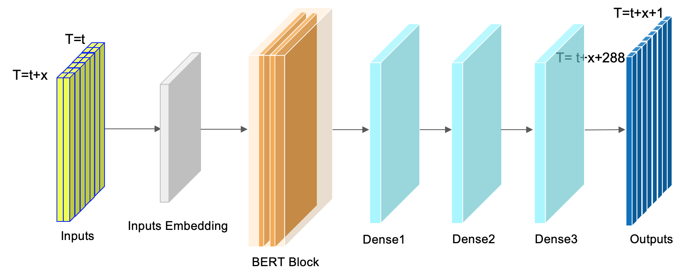

# KDD Cup 2022 - Baidu Spatial Dynamic Wind Power Forecasting

This is the solution for Baidu KDD Cup 2022, winning 3rd place in 2490 teams. 
The task is to predict the wind farm's future 48 hours active power for every 10 minutes.
The source code is taken from https://github.com/LongxingTan/KDDCup2022-Baidu and modified.

<h1 align="center">

</h1><br>

## Solution summary
- A single BERT model is made from TFTS library
- Sliding window to generate more samples
- Only 2 raw features are used, wind speed and direction
- The daily fluctuation is added by post-processing to make the predicted result in line with daily periodicity

## How to reproduce it
0. Prepare the tensorflow environment
```shell
pip install -r requirements.txt
```
1. Download the data from [Baidu AI studio](https://aistudio.baidu.com/aistudio/competition/detail/152/0/introduction), and put it in `./data/raw`
2. Create folders submit/checkpoints and weights
3. Train the model
```shell
cd src/train
python nn_train.py
```
4. The file `result.zip` created in `./weights/` can be used for submit. 


